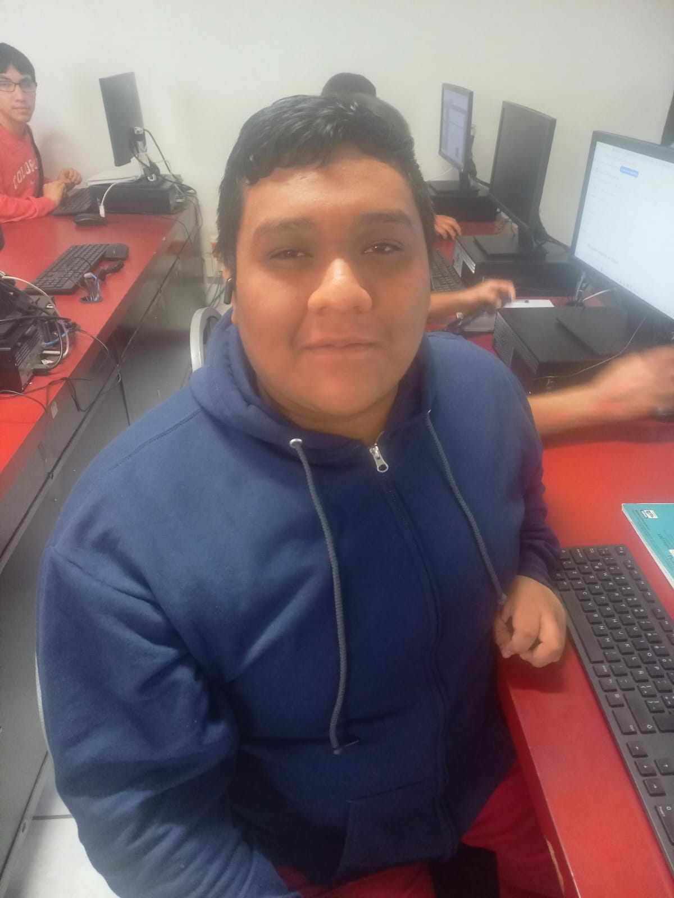

# Documentación de Aplicación
  1. **Objetivo:**
    Crear una aplicacion web nutricional para promover y ayudar en la alimentacion y la salud de la comunidad.

  2. **Integrantes:**
  - Luis Fernando Alvarez Zandate  
    
      
  - Edgar Uriel Morales Torres  
    
 
  4. **Analisis de la Base de Datos:**
