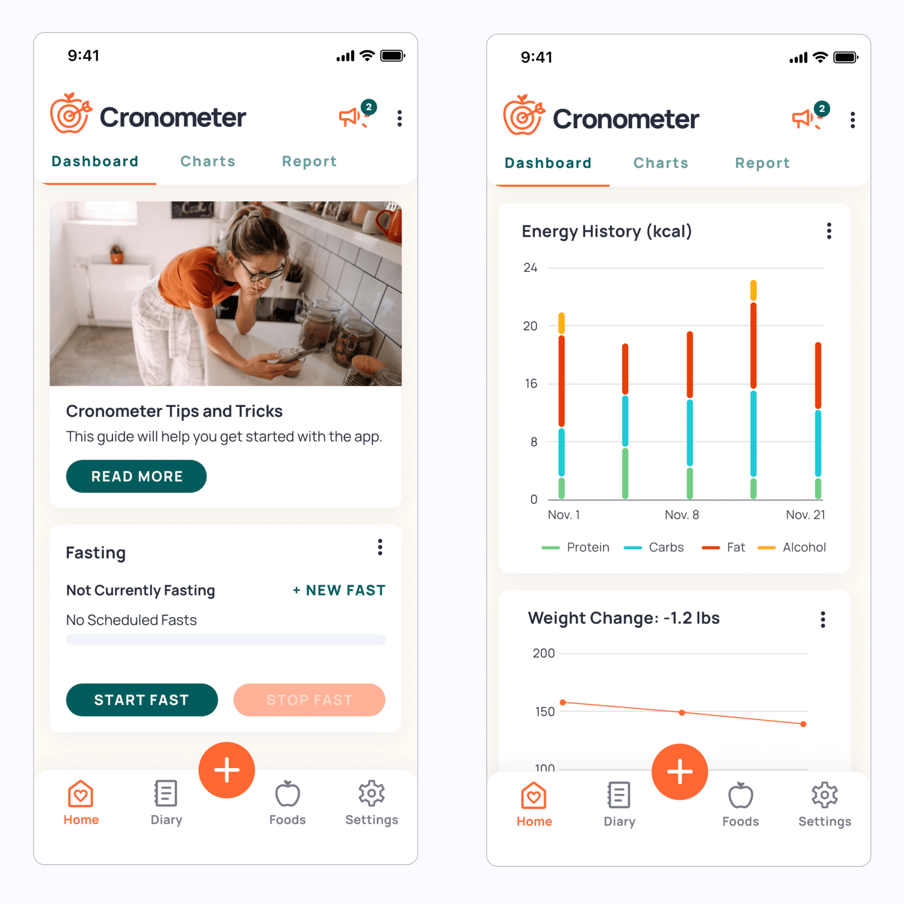
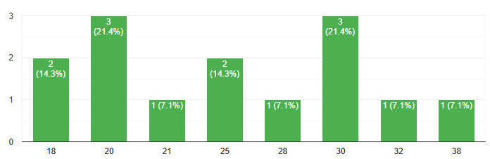
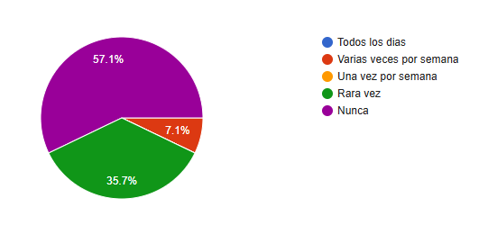
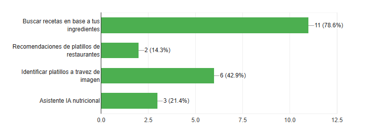

# Análisis Comparativo de Aplicaciones de Nutrición

## Introducción

La nutrición es un componente fundamental para mantener una vida. En la actualidad, las aplicaciones móviles y web se han convertido en herramientas accesibles que permiten a los usuarios llevar un control detallado de su alimentación, seguimiento de calorías, macronutrientes y hábitos alimenticios.  

Esta investigación analiza tres aplicaciones de nutrición ampliamente utilizadas: **MyFitnessPal**, **Cronometer** y **YAZIO**, con el objetivo de evaluar sus funcionalidades, experiencia de usuario, modelo de negocio y características innovadoras para poder crear o tomar inspiración para crear una aplicación totalmente nueva que cubra sus debilidades y con los beneficios de esta misma en una sola.

##  Objetivos de la Investigación

1. Identificar y comparar las funcionalidades principales de cada aplicación.  
2. Analizar la experiencia de usuario (facilidad de uso y diseño) de cada plataforma.  
3. Examinar los modelos de negocio y las opciones de suscripción.  
4. Determinar los puntos fuertes y débiles de cada aplicación.  
5. Reconocer las características innovadoras y diferenciadoras.  
6. Tomar notas de cada una para crear una propuesta de aplicación mejorada.

##  Metodología Utilizada

La investigación se llevó a cabo mediante una revisión detallada de las aplicaciones seleccionadas.  

Se realizaron pruebas prácticas de uso en entornos móviles y web (instalación y revisión de videos informativos), evaluando aspectos como:

- La Facilidad para registrar alimentos  
- Rapidez en la entrada de datos  
- Precisión de la información nutricional  
- Disponibilidad de planes y herramientas adicionales  

También se revisaron las políticas de suscripción y las funcionalidades reservadas a versiones de pago mediante videos, así como la experiencia de usuario a partir de la interfaz y el diseño de cada plataforma leyendo reseñas y buscando críticas. Los resultados se compararon en una tabla resumida para facilitar la visualización de diferencias y similitudes entre las aplicaciones.

##  Análisis de Aplicaciones

###  MyFitnessPal

#### **Funcionalidades principales**
1. Registro de alimentos con búsqueda en una base de datos muy amplia con millones de entradas, ingreso manual, escaneo de código de         barras y creación de recetas.  
2. Diario alimentario con seguimientos de calorías y nutrientes, con opciones avanzadas como metas y objetivos el ganar o perder peso.  
3. Herramientas de planificación de comidas y algunas automatizaciones en las versiones de paga.

#### **Experiencia de usuario**
Interfaz orientada al registro rápido, esta busca priorizar la velocidad de entrada como favoritos, recientes o recetas, fácil para los usuarios que solo necesitan contar las calorías.
El diseño es limpio, pero con mucha información, para los usuarios novatos puedes parecer abrumador al inicio al estar explorando todo.

#### **Modelo de negocio**

Modelo gratis y Premium: funcionalidad base gratuita, con una suscripción Premium que desbloquea análisis más avanzados, métricas personalizadas, y herramientas de planificación. Precios públicos de suscripción (mensual/anual) 

#### **Puntos fuertes**
- Base de datos enorme, muy útil para encontrar alimentos comerciales populares y recetas compartidas por la comunidad. 
- Ecosistema maduro, integraciones con wearables y otras apps, comunidad amplia y recursos como blogs. 
- Rapidez al registrar alimentos.

#### **Debilidades**
- Calidad/fiabilidad variable de entradas comunitarias, al haber tantas entradas generadas por usuarios, la precisión nutricional puede variar.  
- Algunas funciones útiles están detrás del Premium, lo que puede limitar análisis profundo en la versión gratuita. 

#### **Características innovadoras**
Evolución constante hacia entradas más útiles mejoras en Meal Scan y funcionalidades impulsadas por IA/UX recientes. Esto permite inversión en simplificar el registro.

###  Cronometer

#### **Funcionalidades principales**
1. Registro de alimentos con énfasis en exactitud nutricional: desglose muy detallado de macro y micronutrientes. Barcode scanner y base de datos verificada.  
2. Dashboard con análisis y tendencias, herramientas para profesionales como Cronometer pro y funcionalidades avanzadas en la versión Gold como Macro Scheduler, Fasting Timer, Oracle Nutrient Search. 

#### **Experiencia de usuario**
Interfaz orientada a usuarios que valoran datos como paneles con gráficas y tablas detalladas. No es una app simple, para quien solo cuenta calorías, pero es muy apreciada por usuarios que quieren control fino como deportistas y nutricionales.

Buena integración con dispositivos y posibilidad de sincronizar biométricos.

#### **Modelo de negocio**

Modelo mixto: cuenta gratuita con funciones robustas (acceso a la base de datos, escáner, tracking básico) y suscripciones de pago como Gold (o Pro para profesionales) que desbloquean herramientas analíticas avanzadas, planificación y opciones para profesionales de la nutrición. 

#### **Puntos fuertes**
- Precisión y profundidad: es probablemente la app con mayor detalle en micronutrientes disponible al público general. Ideal para evaluaciones nutricionales serias. 
- Opciones para profesionales (Pro) que facilitan análisis, manejo de clientes y exportes. 

#### **Debilidades**
- Curva de aprendizaje, la riqueza de datos puede intimidar a usuarios que solo buscan algo sencillo. 
- Menos “masiva” en comunidad comparada con MyFitnessPal, por lo que algunos usuarios echan en falta entradas comunitarias o recetas populares.

#### **Características innovadoras**
Enfoque en micronutrientes y en datos clínicos esto permite hacer búsquedas por nutrientes raros (como lysine, oxalate) y orientarse hacia la salud basada en biomarcadores. El producto también actualiza con widgets y reportes que resumen tendencias.

###  YAZIO

#### **Funcionalidades principales**
1. Contador de calorías y macros con Food Diary, escáner de códigos de barras, seguimiento de ayunos intermitentes, recetas y planes de dieta para ganar peso o perder peso y alimentarse más sano. 
2. Herramientas de análisis de hábitos alimenticios y unas estadísticas de consumo, oferta de recetas y una base de recetas integrada. 

#### **Experiencia de usuario**

Diseño enfocado en usabilidad, amigable, grandes botones y flujos guiados para establecer metas. Muy buena recepción en tiendas con valoraciones altas, lo que indica satisfacción de usuarios en términos de facilidad de uso. 

#### **Modelo de negocio**
Freemium con PRO (suscripción) que añade mayor profundidad analítica más nutrientes, comparativas por comida, funciones Premium como reconocimiento de comidas por foto en versiones recientes. 

#### **Puntos fuertes**
- Experiencia pulida para el usuario medio, ideal para quienes quieren un plan guiado como pérdida de peso, ayuno. Buen equilibrio entre simplicidad y funcionalidades útiles. 
- Funcionalidades modernas como AI Food Recognition que es un registro por foto y muchas opciones de ayuno intermitente.
- Enfoque en ayuno intermitente.

#### **Debilidades**
- Para análisis nutricionales muy técnicos puede quedarse corto frente a Cronometer (menos profundidad en micronutrientes).
- Algunas funcionalidades clave (AI Food Recognition, reportes detallados) están reservadas a PRO, por lo que el usuario gratuito obtiene una experiencia menos completa. 

#### **Características innovadoras**
Integración fuerte con rutinas de ayuno y uso de IA para reconocimiento de alimentos (facilita registro rápido y moderniza la experiencia). Hojas informativas y tutoriales muestran una apuesta por mantener la app simple y accesible. 

## Comparativa General

| Aspecto | MyFitnessPal | Cronometer | YAZIO |
|----------|---------------|-------------|--------|
| **Funcionalidades principales** |Registro de alimentos, escaneo de códigos, base de datos enorme, seguimiento de calorías y macros, planes de dieta básicos| Registro detallado de alimentos, enfoque en micronutrientes, dashboard avanzado, tracking profesional, escaneo de códigos | Registro de alimentos, escaneo de códigos, planes de dieta, seguimiento de ayuno intermitente, recetas integradas |
| **Experiencia de usuario (UX/UI)** | Fácil de usar, interfaz rápida, información abundante, curva de aprendizaje media | Interfaz orientada a datos, más técnica, curva de aprendizaje alta | Muy amigable, onboarding guiado, fácil de usar, diseño moderno y limpio |
| **Modelo de negocio** | Freemium (gratis con funciones básicas, Premium con análisis avanzados) | Gratuita con opción Gold/Pro (funciones avanzadas y para profesionales) | Freemium con PRO (más nutrientes, reconocimiento de comidas por foto, reportes) |
| **Puntos fuertes** | Base de datos enorme, ecosistema maduro, registro rápido, comunidad amplia | Precisión nutricional, profundidad en micronutrientes, herramientas para profesionales | Experiencia de usuario amigable, registro rápido por foto, integración con ayuno intermitente |
| **Debilidades** | Calidad variable de entradas comunitarias, algunas funciones detrás de Premium | Curva de aprendizaje alta, menos comunidad, menos recetas comerciales | Menos detalle en micronutrientes, funciones clave reservadas a PRO |
| **Características innovadoras** |Evolución constante, mejoras en registro y uso de IA para facilitar logging | Búsqueda avanzada por nutrientes, reportes y gráficas de tendencias, enfoque profesional | IA para reconocimiento de comidas, seguimiento de ayuno guiado, experiencia moderna y accesible |

##  Diseño y Resultados de la Encuesta

### **Diseño**

#### **Justificación de Preguntas**
- **Correo electrónico (opcional):** Tan solo sirve para la identidad del encuestado, aunque también puede ser anónimo. Ningún uso en concreto.
-	**Edad:** Puede ser de utilidad para saber el promedio de edad del público que podría usar nuestra app.
-	**Cuéntanos tus experiencias previas con las aplicaciones nutricionales (si las tienes):** Puede ayudarnos si tuvo alguna mala experiencia para saber qué es lo que busca en una app de este tipo.
-	**¿Con que frecuencia usas apps nutricionales?:** Con esta podemos medir la frecuencia en la que los usuarios la usan, a su vez contextualizando sus opiniones y evaluando sus experiencias reales en este tipo de apps.
-	**¿Con que propósito usarías (o no) una aplicación nutricional?:** Nos hace saber con qué razón el público usaría o que buscaría de una app nutricional.
-	**¿Qué tipo de recetas te gustaría encontrar en una aplicación de nutrición?:** Nos dice el tipo de recetas que busca el público en una aplicación nutricional, sus características y condiciones.
-	**¿Qué tan importante es para ti que las recetas incluyan información nutricional detallada (calorías, proteínas, grasas, carbohidratos, etc.) ?:** Nos hace saber la importancia que le da el público a la información nutricional, y si la prefiere simple o detallada.
-	**¿Algún problema o defecto que hayas notado en apps nutricionales? Si es así, ¿Cuál fue?:** Es de utilidad para saber que defectos comunes tienen este tipo de apps, y así saber cómo resolverlos.
-	**¿Qué aspectos y/o características valoras en una aplicación nutricional?:** Nos hace saber qué factores toman en cuenta los usuarios al momento de elegir una app nutricional para su comodidad.
-	**¿Qué tan fácil te resulta usar una app de nutrición promedio (en cuanto a diseño, menús y navegación) ?:** De utilidad para saber qué tipo de diseño visual le gustaría al público, tanto en la estética, como la jerarquía de la app.
-	**¿Te gustaría que la app incluyera recordatorios o notificaciones para ayudarte a seguir tus hábitos saludables?:** Para saber la preferencia de recordatorios o notificaciones para los usuarios.
-	**¿Qué funciones y/o herramientas valoras en una app nutricional?:** Se les hace marcar 1 o más de las 4 opciones de funciones dentro de la app que les parezcan buenas, y así saber cuál conviene para los usuarios.
-	**¿Qué mejorarías o agregarías en las apps nutricionales actuales para que fueran más útiles para ti?:** A diferencia de la pregunta posterior, en esta el público puede sugerir que agregar dentro de la app que les sea de utilidad y les convenga, a su vez cubriendo varias necesidades que talvez el público no sabía que tenía.

### **Metodología**
- **Tipo de Encuesta:** En línea mediante la herramienta Google Forms, un acceso sencillo y rápido para los encuestados. Este formato se eligió por su accesibilidad y porque permite llegar a resultados variados.
- **Muestra:** Se encuestaron 14 personas seleccionadas al azar, para obtener una variedad de opiniones y experiencias sobre el uso de apps nutricionales.
- **Instrumento:** La encuesta tuvo un total de 13 preguntas, mezclando preguntas abiertas y cerradas, ordenadas por: la información del encuestado, antecedentes, y opiniones y preferencias.
- **Periodo de Aplicación:** 25 al 26 de octubre del 2025.
- **Procedimiento:** Los datos se recolectaron automáticamente a través de Google Forms, y posteriormente se analizaron con las herramientas estadísticas básicas integradas en la plataforma, complementadas con observaciones y comparaciones de las respuestas abiertas.

##  Resultados

### **Gráficos**

- **Edad**  
  

- **Frecuencia de uso de apps nutricionales**  
  

- **Importancia de la información nutricional**  
  

- **Facilidad de uso percibida**  
  

- **Preferencia por recordatorios**  
  

- **Funciones valoradas**  
  

##  Análisis de Datos

-	**Cuéntanos tus experiencias previas con las aplicaciones nutricionales (si las tienes):** Los resultados señalan que sus experiencias previas son mayormente negativas, estas siendo que requieren paga, son difíciles de usar, y que “restan en vez de sumar”, es decir, afectan la salud en vez de mejorarla.

-	**¿Con que propósito usarías (o no) una aplicación nutricional?:** El resultado promedio señala que el propósito principal del público al entrar a una app nutricional es para mejorar su alimentación, seguido de este el bajar de peso y obtener información de los alimentos que consumen.

-	**¿Qué tipo de recetas te gustaría encontrar en una aplicación de nutrición?:** Los resultados señalan que el público prefiere recetas mayormente proteicas, snacks o postres, y en cuanto a las demás son más una descripción de la comida en sí: saludables, fáciles, rápidas y sencillas, baja en calorías.

-	**¿Algún problema o defecto que hayas notado en apps nutricionales? Si es así, ¿Cuál fue?:** Los resultados señalan que los problemas más comunes dentro de estas aplicaciones es que en su mayoría requieren paga y son complejas o difíciles de usar, después de estas siendo que las recetas contienen ciertos ingredientes o productos fuera del alcance del usuario, y que estas aplicaciones están llenas de anuncios.

-	**¿Qué aspectos y/o características valoras en una aplicación nutricional?:** Los resultados señalan que, en su mayoría, el público prefiere antes que nada una buena estructuración general de la aplicación, tanto en su facilidad de uso, como en su simplicidad y limpieza. Después de eso, el público también busca que los alimentos tengan información detallada de los mismos, que la app sea gratuita y sin distracciones como anuncios.

-	**¿Qué mejorarías o agregarías en las apps nutricionales actuales para que fueran más útiles para ti?:** Las funciones nuevas que el público sugirió fueron:

1. Mostrar medidas y sustitutos de ingredientes dentro de las recetas.

2. Recetas en caso de estar fuera de casa (posible solución: platillos de menús).

3. Mostrar platillos diferentes cada semana, aleatorios o en base a los gustos y preferencias del usuario.

4. Personalización en general.

##  Hallazgos Principales
Se observa que los usuarios buscan una app nutricional saludable, práctica y confiable, enfocada principalmente en mejorar la alimentación más que solo en bajar de peso. Valoran especialmente que la app ofrezca recetas saludables, fáciles, rápidas y variadas, así como funciones que ayuden a regular las calorías y organizar los hábitos alimenticios. Además, destacan la importancia de que la app sea fácil de usar, limpia, llamativa y efectiva, lo cual refleja una preferencia por una experiencia sencilla pero completa.

##  Conclusiones y Oportunidades

### **Síntesis de Aprendizajes**
A partir del análisis de la encuesta y la revisión de aplicaciones nutricionales, se concluye que los usuarios buscan principalmente simplicidad y personalización. Valoran las apps que sean intuitivas, visualmente limpias y que ofrezcan recetas saludables y variadas, especialmente aquellas que se adapten a diferentes objetivos, como mejorar la alimentación o mantener el peso. También se identificó una preferencia por herramientas que integren seguimiento de calorías, organización de comidas y recordatorios prácticos.

### **Oportunidades Futuras**
Existe una oportunidad para crear una aplicación precisa, dinámica y llamativa, centrada en un enfoque más humano. Los usuarios podrían beneficiarse de funciones innovadoras como recetas filtradas por tiempo y dificultad, integración con metas de bienestar general (no solo calorías) y un sistema de retroalimentación visual que premie el progreso diario.

### **Recomendaciones**
Se recomienda desarrollar una app que mantenga un equilibrio entre lo funcional y lo accesible, priorizando una experiencia limpia, simple y atractiva. El diseño debería enfocarse en una navegación clara, con secciones organizadas. Es fundamental incluir recetas saludables y fáciles, además de herramientas que ayuden a planificar y regular la alimentación sin rigidez.

