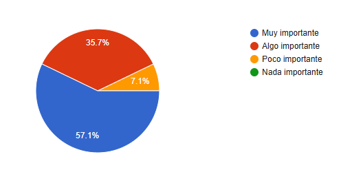

# Análisis Comparativo de Aplicaciones de Nutrición

## Introducción

La nutrición es un componente fundamental para mantener una vida saludable. En la actualidad, las aplicaciones móviles y web se han convertido en herramientas accesibles que permiten a los usuarios llevar un control detallado de su alimentación, seguimiento de calorías, macronutrientes y hábitos alimenticios.  

Esta investigación analiza tres aplicaciones de nutrición ampliamente utilizadas: **MyFitnessPal**, **Cronometer** y **YAZIO**, con el objetivo de evaluar sus funcionalidades, experiencia de usuario, modelo de negocio y características innovadoras, para inspirar el desarrollo de una nueva aplicación que combine sus fortalezas y resuelva sus debilidades.

##  Objetivos de la Investigación

1. Identificar y comparar las funcionalidades principales de cada aplicación.  
2. Analizar la experiencia de usuario (facilidad de uso y diseño) de cada plataforma.  
3. Examinar los modelos de negocio y las opciones de suscripción.  
4. Determinar los puntos fuertes y débiles de cada aplicación.  
5. Reconocer las características innovadoras y diferenciadoras.  
6. Tomar notas de cada una para crear una propuesta de aplicación mejorada.

##  Metodología Utilizada

La investigación se llevó a cabo mediante una revisión detallada de las aplicaciones seleccionadas.  

Se realizaron pruebas prácticas de uso en entornos móviles y web (instalación y revisión de videos informativos), evaluando aspectos como:

- Facilidad para registrar alimentos  
- Rapidez en la entrada de datos  
- Precisión de la información nutricional  
- Disponibilidad de planes y herramientas adicionales  

También se analizaron:

- Políticas de suscripción y funciones Premium  
- Experiencia de usuario mediante reseñas y críticas  
- Comparación de resultados en una tabla resumen  

##  Análisis de Aplicaciones

###  MyFitnessPal

#### **Funcionalidades principales**
1. Registro de alimentos con base de datos amplia, ingreso manual, escaneo de código de barras y creación de recetas.  
2. Diario alimentario con seguimiento de calorías y nutrientes, con metas personalizadas.  
3. Herramientas de planificación de comidas (más avanzadas en la versión Premium).

#### **Experiencia de usuario**
Interfaz rápida y orientada al registro. Prioriza la velocidad, aunque puede resultar abrumadora para usuarios nuevos.  
Diseño limpio, pero con abundante información.

#### **Modelo de negocio**
Freemium: funciones básicas gratuitas y suscripción Premium para análisis avanzados, métricas personalizadas y planificación.

#### **Puntos fuertes**
- Base de datos enorme.  
- Integración con wearables y comunidad activa.  
- Rapidez al registrar alimentos.

#### **Debilidades**
- Variabilidad en la calidad de las entradas comunitarias.  
- Funciones útiles bloqueadas en Premium.

#### **Características innovadoras**
Uso creciente de IA en funciones como *Meal Scan* y mejoras UX.  

###  Cronometer

#### **Funcionalidades principales**
1. Registro de alimentos con enfoque en exactitud nutricional y análisis detallado de micro y macronutrientes.  
2. Dashboard avanzado, herramientas profesionales (Cronometer Pro), y funciones como *Macro Scheduler*, *Fasting Timer* y *Oracle Nutrient Search*.

#### **Experiencia de usuario**
Orientada a usuarios que valoran los datos y precisión. Ideal para deportistas o profesionales.  
Curva de aprendizaje más alta, pero con integración de dispositivos biométricos.

#### **Modelo de negocio**
Modelo mixto: versión gratuita robusta y suscripción *Gold/Pro* con herramientas analíticas avanzadas.

#### **Puntos fuertes**
- Precisión y detalle en nutrientes.  
- Opciones para profesionales y reportes avanzados.

#### **Debilidades**
- Curva de aprendizaje pronunciada.  
- Comunidad menos activa que MyFitnessPal.

#### **Características innovadoras**
Enfoque clínico en micronutrientes raros, reportes con tendencias y biomarcadores.  

###  YAZIO

#### **Funcionalidades principales**
1. Contador de calorías y macros, escáner de códigos, seguimiento de ayunos, recetas y planes personalizados.  
2. Estadísticas de hábitos alimenticios y recetas integradas.

#### **Experiencia de usuario**
Diseño moderno, simple y amigable. Excelente recepción en tiendas por su facilidad de uso y navegación guiada.

#### **Modelo de negocio**
Freemium con versión PRO que añade análisis detallado, reconocimiento de comidas por foto y más métricas.

#### **Puntos fuertes**
- Experiencia de usuario pulida.  
- Funcionalidades modernas como *AI Food Recognition*.  
- Enfoque en ayuno intermitente.

#### **Debilidades**
- Menor profundidad en micronutrientes que Cronometer.  
- Funciones clave bloqueadas en PRO.

#### **Características innovadoras**
Integración con IA y rutinas de ayuno, interfaz moderna y accesible.  

## Comparativa General

| Aspecto | MyFitnessPal | Cronometer | YAZIO |
|----------|---------------|-------------|--------|
| **Funcionalidades principales** |Registro de alimentos, escaneo de códigos, base de datos enorme, seguimiento de calorías y macros, planes de dieta básicos| Registro detallado de alimentos, enfoque en micronutrientes, dashboard avanzado, tracking profesional, escaneo de códigos | Registro de alimentos, escaneo de códigos, planes de dieta, seguimiento de ayuno intermitente, recetas integradas |
| **Experiencia de usuario (UX/UI)** | Rápida, informativa, curva media | Técnica, orientada a datos, curva alta | Muy amigable, diseño limpio |
| **Modelo de negocio** | Freemium (Premium con análisis avanzados) | Gratuito con Gold/Pro | Freemium con PRO (IA y reportes) |
| **Puntos fuertes** | Base de datos grande, comunidad activa | Precisión nutricional, herramientas pro | Interfaz moderna, reconocimiento por foto |
| **Debilidades** | Calidad variable en entradas, Premium limitado | Curva alta, poca comunidad | Menos detalle técnico, funciones bloqueadas |
| **Características innovadoras** | IA en registro, evolución constante | Análisis por nutrientes raros | IA, seguimiento de ayuno y recetas guiadas |

---

##  Diseño y Resultados de la Encuesta

### **Diseño**

#### **Justificación de Preguntas**
Se incluyeron preguntas demográficas, de experiencia y preferencias para entender las necesidades del público objetivo.  
Algunos ejemplos:

- Edad y experiencias previas con apps.  
- Frecuencia y propósito de uso.  
- Tipos de recetas deseadas.  
- Opiniones sobre información nutricional y facilidad de uso.  
- Preferencias sobre recordatorios, funciones y mejoras sugeridas.

### **Metodología**

- **Tipo de encuesta:** En línea (Google Forms).  
- **Muestra:** 14 personas seleccionadas al azar.  
- **Instrumento:** 13 preguntas abiertas y cerradas.  
- **Periodo:** 25–26 de octubre de 2025.  
- **Procedimiento:** Análisis estadístico básico con observaciones cualitativas.

##  Resultados

### **Gráficos**

- **Edad**  
  

- **Frecuencia de uso de apps nutricionales**  
  

- **Importancia de la información nutricional**  
  

- **Facilidad de uso percibida**  
  

- **Preferencia por recordatorios**  
  

- **Funciones valoradas**  
  

---

##  Análisis de Datos

- **Experiencias previas:** En su mayoría negativas por pago obligatorio o dificultad de uso.  
- **Propósito de uso:** Mejorar alimentación y bajar de peso.  
- **Recetas preferidas:** Proteicas, saludables, fáciles y rápidas.  
- **Problemas comunes:** Pagos, complejidad, ingredientes poco accesibles y anuncios.  
- **Aspectos valorados:** Simplicidad, limpieza visual, información detallada y gratuidad.  
- **Sugerencias:**  
  1. Medidas y sustitutos en recetas.  
  2. Opciones fuera de casa.  
  3. Recetas semanales personalizadas.  
  4. Mayor personalización general.

##  Hallazgos Principales

Los usuarios buscan una aplicación **simple, confiable y práctica**, enfocada en mejorar la alimentación más que en perder peso.  
Valoran recetas saludables, variadas y rápidas, junto con herramientas que regulen hábitos y calorías.  
Además, prefieren interfaces **claras, limpias y efectivas**, que equilibren funcionalidad y usabilidad.

---

##  Conclusiones y Oportunidades

### **Síntesis de Aprendizajes**
Los usuarios prefieren apps **intuitivas, limpias y personalizables**, con recetas saludables y funciones de seguimiento integradas.  
Se destaca la necesidad de simplicidad visual y flexibilidad.

### **Oportunidades Futuras**
Crear una app precisa y dinámica con:
- Recetas filtradas por tiempo, dificultad y objetivos.  
- Integración con metas de bienestar general.  
- Sistema visual de progreso y retroalimentación.

### **Recomendaciones**
Desarrollar una app **funcional pero accesible**, con navegación clara, diseño atractivo y secciones bien organizadas.  
Debe incluir:
- Recetas saludables y sencillas.  
- Planificación alimentaria flexible.  
- Herramientas motivacionales y recordatorios inteligentes.

