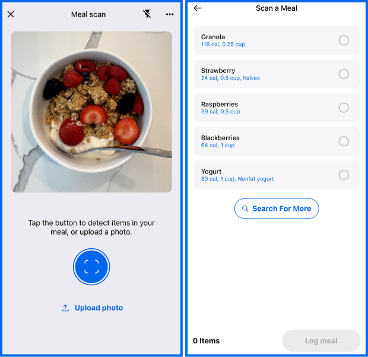
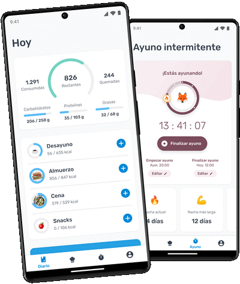
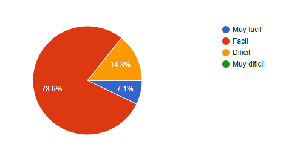
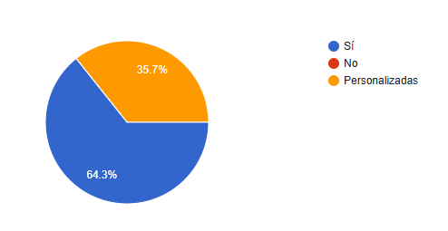

# Análisis Comparativo de Aplicaciones de Nutrición

## Introducción

La nutrición es un componente fundamental para mantener una vida. En la actualidad, las aplicaciones móviles y web se han convertido en herramientas accesibles que permiten a los usuarios llevar un control detallado de su alimentación, seguimiento de calorías, macronutrientes y hábitos alimenticios.  

Esta investigación analiza tres aplicaciones de nutrición ampliamente utilizadas: **MyFitnessPal**, **Cronometer** y **YAZIO**, con el objetivo de evaluar sus funcionalidades, experiencia de usuario, modelo de negocio y características innovadoras para poder crear o tomar inspiración para crear una aplicación totalmente nueva que cubra sus debilidades y con los beneficios de esta misma en una sola.

##  Objetivos de la Investigación

1. Identificar y comparar las funcionalidades principales de cada aplicación.  
2. Analizar la experiencia de usuario (facilidad de uso y diseño) de cada plataforma.  
3. Examinar los modelos de negocio y las opciones de suscripción.  
4. Determinar los puntos fuertes y débiles de cada aplicación.  
5. Reconocer las características innovadoras y diferenciadoras.  
6. Tomar notas de cada una para crear una propuesta de aplicación mejorada.

##  Metodología Utilizada

La investigación se llevó a cabo mediante una revisión detallada de las aplicaciones seleccionadas.  

Se realizaron pruebas prácticas de uso en entornos móviles y web (instalación y revisión de videos informativos), evaluando aspectos como:

- La Facilidad para registrar alimentos  
- Rapidez en la entrada de datos  
- Precisión de la información nutricional  
- Disponibilidad de planes y herramientas adicionales  

También se revisaron las políticas de suscripción y las funcionalidades reservadas a versiones de pago mediante videos, así como la experiencia de usuario a partir de la interfaz y el diseño de cada plataforma leyendo reseñas y buscando críticas. Los resultados se compararon en una tabla resumida para facilitar la visualización de diferencias y similitudes entre las aplicaciones.

##  Análisis de Aplicaciones

###  MyFitnessPal

#### **Funcionalidades principales**
1. Registro de alimentos con búsqueda en una base de datos muy amplia con millones de entradas, ingreso manual, escaneo de código de         barras y creación de recetas.  
2. Diario alimentario con seguimientos de calorías y nutrientes, con opciones avanzadas como metas y objetivos el ganar o perder peso.  
3. Herramientas de planificación de comidas y algunas automatizaciones en las versiones de paga.

#### **Experiencia de usuario**
Interfaz orientada al registro rápido, esta busca priorizar la velocidad de entrada como favoritos, recientes o recetas, fácil para los usuarios que solo necesitan contar las calorías.
El diseño es limpio, pero con mucha información, para los usuarios novatos puedes parecer abrumador al inicio al estar explorando todo.

#### **Modelo de negocio**

Modelo gratis y Premium: funcionalidad base gratuita, con una suscripción Premium que desbloquea análisis más avanzados, métricas personalizadas, y herramientas de planificación. Precios públicos de suscripción (mensual/anual) 

#### **Puntos fuertes**
- Base de datos enorme, muy útil para encontrar alimentos comerciales populares y recetas compartidas por la comunidad. 
- Ecosistema maduro, integraciones con wearables y otras apps, comunidad amplia y recursos como blogs. 
- Rapidez al registrar alimentos.

#### **Debilidades**
- Calidad/fiabilidad variable de entradas comunitarias, al haber tantas entradas generadas por usuarios, la precisión nutricional puede variar.  
- Algunas funciones útiles están detrás del Premium, lo que puede limitar análisis profundo en la versión gratuita. 

#### **Características innovadoras**
Evolución constante hacia entradas más útiles mejoras en Meal Scan y funcionalidades impulsadas por IA/UX recientes. Esto permite inversión en simplificar el registro.

###  Cronometer

#### **Funcionalidades principales**
1. Registro de alimentos con énfasis en exactitud nutricional: desglose muy detallado de macro y micronutrientes. Barcode scanner y base de datos verificada.  
2. Dashboard con análisis y tendencias, herramientas para profesionales como Cronometer pro y funcionalidades avanzadas en la versión Gold como Macro Scheduler, Fasting Timer, Oracle Nutrient Search. 

#### **Experiencia de usuario**
Interfaz orientada a usuarios que valoran datos como paneles con gráficas y tablas detalladas. No es una app simple, para quien solo cuenta calorías, pero es muy apreciada por usuarios que quieren control fino como deportistas y nutricionales.

Buena integración con dispositivos y posibilidad de sincronizar biométricos.

#### **Modelo de negocio**

Modelo mixto: cuenta gratuita con funciones robustas (acceso a la base de datos, escáner, tracking básico) y suscripciones de pago como Gold (o Pro para profesionales) que desbloquean herramientas analíticas avanzadas, planificación y opciones para profesionales de la nutrición. 

#### **Puntos fuertes**
- Precisión y profundidad: es probablemente la app con mayor detalle en micronutrientes disponible al público general. Ideal para evaluaciones nutricionales serias. 
- Opciones para profesionales (Pro) que facilitan análisis, manejo de clientes y exportes. 

#### **Debilidades**
- Curva de aprendizaje, la riqueza de datos puede intimidar a usuarios que solo buscan algo sencillo. 
- Menos “masiva” en comunidad comparada con MyFitnessPal, por lo que algunos usuarios echan en falta entradas comunitarias o recetas populares.

#### **Características innovadoras**
Enfoque en micronutrientes y en datos clínicos esto permite hacer búsquedas por nutrientes raros (como lysine, oxalate) y orientarse hacia la salud basada en biomarcadores. El producto también actualiza con widgets y reportes que resumen tendencias.

###  YAZIO

#### **Funcionalidades principales**
1. Contador de calorías y macros, escáner de códigos, seguimiento de ayunos, recetas y planes personalizados.  
2. Estadísticas de hábitos alimenticios y recetas integradas.

#### **Experiencia de usuario**
Diseño moderno, simple y amigable. Excelente recepción en tiendas por su facilidad de uso y navegación guiada.

#### **Modelo de negocio**
Freemium con versión PRO que añade análisis detallado, reconocimiento de comidas por foto y más métricas.

#### **Puntos fuertes**
- Experiencia de usuario pulida.  
- Funcionalidades modernas como *AI Food Recognition*.  
- Enfoque en ayuno intermitente.

#### **Debilidades**
- Menor profundidad en micronutrientes que Cronometer.  
- Funciones clave bloqueadas en PRO.

#### **Características innovadoras**
Integración con IA y rutinas de ayuno, interfaz moderna y accesible.  

## Comparativa General

| Aspecto | MyFitnessPal | Cronometer | YAZIO |
|----------|---------------|-------------|--------|
| **Funcionalidades principales** |Registro de alimentos, escaneo de códigos, base de datos enorme, seguimiento de calorías y macros, planes de dieta básicos| Registro detallado de alimentos, enfoque en micronutrientes, dashboard avanzado, tracking profesional, escaneo de códigos | Registro de alimentos, escaneo de códigos, planes de dieta, seguimiento de ayuno intermitente, recetas integradas |
| **Experiencia de usuario (UX/UI)** | Fácil de usar, interfaz rápida, información abundante, curva de aprendizaje media | Interfaz orientada a datos, más técnica, curva de aprendizaje alta | Muy amigable, onboarding guiado, fácil de usar, diseño moderno y limpio |
| **Modelo de negocio** | Freemium (gratis con funciones básicas, Premium con análisis avanzados) | Gratuita con opción Gold/Pro (funciones avanzadas y para profesionales) | Freemium con PRO (más nutrientes, reconocimiento de comidas por foto, reportes) |
| **Puntos fuertes** | Base de datos enorme, ecosistema maduro, registro rápido, comunidad amplia | Precisión nutricional, profundidad en micronutrientes, herramientas para profesionales | Experiencia de usuario amigable, registro rápido por foto, integración con ayuno intermitente |
| **Debilidades** | Calidad variable de entradas comunitarias, algunas funciones detrás de Premium | Curva de aprendizaje alta, menos comunidad, menos recetas comerciales | Menos detalle en micronutrientes, funciones clave reservadas a PRO |
| **Características innovadoras** |Evolución constante, mejoras en registro y uso de IA para facilitar logging | Búsqueda avanzada por nutrientes, reportes y gráficas de tendencias, enfoque profesional | IA para reconocimiento de comidas, seguimiento de ayuno guiado, experiencia moderna y accesible |

##  Diseño y Resultados de la Encuesta

### **Diseño**

#### **Justificación de Preguntas**
Se incluyeron preguntas demográficas, de experiencia y preferencias para entender las necesidades del público objetivo.  
Algunos ejemplos:

- Edad y experiencias previas con apps.  
- Frecuencia y propósito de uso.  
- Tipos de recetas deseadas.  
- Opiniones sobre información nutricional y facilidad de uso.  
- Preferencias sobre recordatorios, funciones y mejoras sugeridas.

### **Metodología**

- **Tipo de encuesta:** En línea (Google Forms).  
- **Muestra:** 14 personas seleccionadas al azar.  
- **Instrumento:** 13 preguntas abiertas y cerradas.  
- **Periodo:** 25–26 de octubre de 2025.  
- **Procedimiento:** Análisis estadístico básico con observaciones cualitativas.

##  Resultados

### **Gráficos**

- **Edad**  
  

- **Frecuencia de uso de apps nutricionales**  
  

- **Importancia de la información nutricional**  
  

- **Facilidad de uso percibida**  
  

- **Preferencia por recordatorios**  
  

- **Funciones valoradas**  
  

##  Análisis de Datos

- **Experiencias previas:** En su mayoría negativas por pago obligatorio o dificultad de uso.  
- **Propósito de uso:** Mejorar alimentación y bajar de peso.  
- **Recetas preferidas:** Proteicas, saludables, fáciles y rápidas.  
- **Problemas comunes:** Pagos, complejidad, ingredientes poco accesibles y anuncios.  
- **Aspectos valorados:** Simplicidad, limpieza visual, información detallada y gratuidad.  
- **Sugerencias:**  
  1. Medidas y sustitutos en recetas.  
  2. Opciones fuera de casa.  
  3. Recetas semanales personalizadas.  
  4. Mayor personalización general.

##  Hallazgos Principales

Los usuarios buscan una aplicación **simple, confiable y práctica**, enfocada en mejorar la alimentación más que en perder peso.  
Valoran recetas saludables, variadas y rápidas, junto con herramientas que regulen hábitos y calorías.  
Además, prefieren interfaces **claras, limpias y efectivas**, que equilibren funcionalidad y usabilidad.

##  Conclusiones y Oportunidades

### **Síntesis de Aprendizajes**
Los usuarios prefieren apps **intuitivas, limpias y personalizables**, con recetas saludables y funciones de seguimiento integradas.  
Se destaca la necesidad de simplicidad visual y flexibilidad.

### **Oportunidades Futuras**
Crear una app precisa y dinámica con:
- Recetas filtradas por tiempo, dificultad y objetivos.  
- Integración con metas de bienestar general.  
- Sistema visual de progreso y retroalimentación.

### **Recomendaciones**
Desarrollar una app **funcional pero accesible**, con navegación clara, diseño atractivo y secciones bien organizadas.  
Debe incluir:
- Recetas saludables y sencillas.  
- Planificación alimentaria flexible.  
- Herramientas motivacionales y recordatorios inteligentes.

